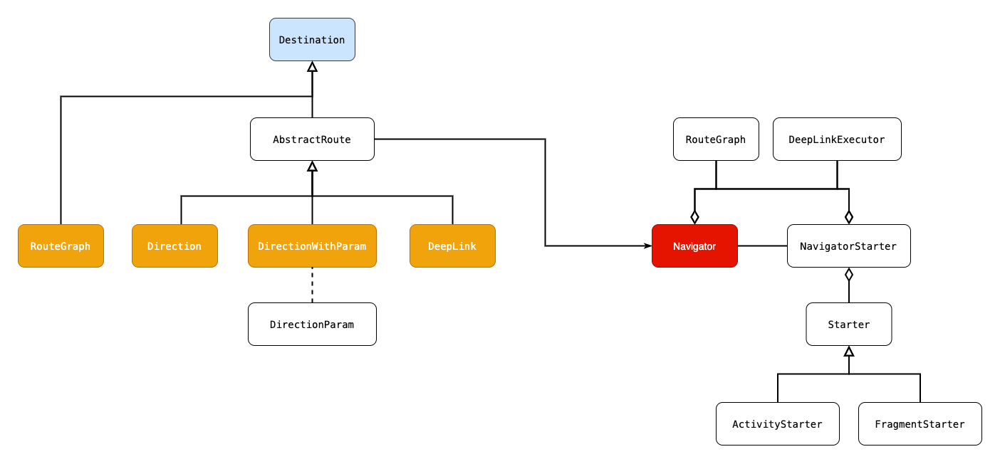

🚧🚧🚧 WIP 🚧🚧🚧

# Navigator

Navigator 라이브러리는 `멀티 모듈 간의 화면 이동`을 유연하게 정의하고 사용하기 위한 목적으로 만들어졌습니다.

### Target

현재 화면 이동은 다음 Android Component를 지원합니다.

- Activity/Fragment to Activity
- Fragment (TBD)

### Architecture



### Multi module sample

```
project
│
├──app
│
├──RoutesConst : define navigation routes
│
├── features
│   ├──featureHome
│   │  └──Sample : Navigator
│   ├──feature1
│   │  └──Sample : Navigator, DeepLink, Graph
│   └──feature2
│      └──Sample : Navigator, DeepLink
│
└──core-android : Utility
```

## Define Configuration

## 1. Config

- DeepLink Base Scheme

```kotlin
import com.pluu.navigator.Navigator
import com.pluu.navigator.NavigatorController

// Define Config
val config = NavigatorController.Config(
    baseScheme = "pluu"
)
Navigator.registerConfig(config)
```

## 2. Define Direction

Define navigation directions

```kotlin
import com.pluu.navigator.Direction
import com.pluu.navigator.DirectionParam
import com.pluu.navigator.DirectionWithParam

object SampleDirection {
    object Feature1 : Direction()
    object Feature2 : DirectionWithParam<SampleParam>()
}

class SampleParam(val value: Int) : DirectionParam()
```

### Register Pattern#1 : Provider Interface

```kotlin
import com.pluu.navigator.provider.Provider

// Step1. Define Route
class SampleProvider : Provider {
    override fun provide() {
        SampleDirection.Feature1.register { starter ->
            Intent(starter.context, SampleActivity::class.java)
        }
        // more ...
    }
}

// Step2. Register route
val sampleProvider: Provider = /** Provider */
sampleProvider.provide()
```

### Register Pattern#2 : Functional

```kotlin
// Simple funtion provider
import com.pluu.navigator.provider.routeProvider

// Step1. Define Route
val sampleProvider = routeProvider(SampleDirection.Feature1) { starter ->
    Intent(starter.context, SampleActivity::class.java)
}

// Step2. Register route
sampleProvider.provide()
```

### Using direction ~ Navigator

Simple startActivity

```kotlin
Navigator.of(/** Activity or Fragment */)
   .start(/** Direction */)

Navigator.of(/** Activity or Fragment */)
   .start(direction = /** Direction */, param = /** param */)
```

Simple startActivityForResult

```kotlin
Navigator.of(/** Activity or Fragment */)
   .startForResult(
      direction = /** Direction */, 
      requestCode = /** Request Code */
   )

Navigator.of(/** Activity or Fragment */)
   .startForResult(
      direction = /** Direction */, 
      param = /** param */, 
   		requestCode = /** Request Code */
   )
```

Simple startActivityForResult ActivityResultLauncher

```kotlin
Navigator.of(/** Activity or Fragment */)
   .startForResult(
      direction = /** Direction */, 
      launcher = /** ActivityResultLauncher Launcher */
   )

Navigator.of(/** Activity or Fragment */)
   .startForResult(
      direction = /** Direction */, 
      param = /** param */, 
      launcher = /** ActivityResultLauncher Launcher */
   )
```

### Using direction ~ Received parameter

Navigator로 전달된 데이터는 `DIRECTION_PARAMS_KEY` 를 키로 하여 `Serializable` 로 Intent에 담아서 꺼냅니다.

```kotlin
package com.pluu.navigator

const val DIRECTION_PARAMS_KEY = "DIRECTION_PARAMS_KEY"
```

Simple Function

- getter 함수를 가지는 bindExtra는 DIRECTION_PARAMS_KEY를 키로 하여 넘겨진 `Serializable` 데이터에서 특정 필드를 가져올 때 유용한 함수입니다.

|                                            | NonNull Return |
| ------------------------------------------ | -------------- |
| bindExtra<T>                               | O              |
| optionalBindExtra<T>                       | X              |
| bindExtra<T, R>(getter: (T)  -> R)         | O              |
| optionalBindExtra<T, G>(getter: (T)  -> R) | X              |

```kotlin
class SampleActivity : AppCompatActivity(R.layout.activity_sample) {
    
    private val param1 by bindExtra</**Getter Type*/>()  
    private val param2 by optionalBindExtra</**Getter Type*/>()
    private val param3 by bindExtra</**Root Type*/, /**Getter Type*/> {
			// do return action
    }
    private val param4 by optionalBindExtra</**Root Type*/, /**Getter Type*/> {
			// do return action
    }
}
```

## 3. Define DeepLink

딥 링크의 파라미터 값은 다음과 같이 생성됩니다.

- `{placeholder_name}` 형식의 쿼리 매개변수 자리표시자는 1개 이상의 문자와 일치합니다.
  - 예) http://www.example.com/search/id={id} 는 http://www.example.com/search/id=4 과 일치합니다.
- 전달된 딥 링크는 각 `{placeholder name}`  형식을 키로하여 매개변수 값을 전달합니다.
  - 예) http://www.example.com/search/arg1={arg_1}&arg2={arg_2} 는 http://www.example.com/search/arg1=sample1=arg2=sample2 과 일치합니다.
  - 최종적으로 다음의 Map 형태로 구성됩니다. arg_1 = sample1, arg_2 = sample2

### Register Pattern#1 : Provider Interface

```kotlin
// Provider Interface
import com.pluu.navigator.DeepLink
import com.pluu.navigator.provider.Provider

// Step1. Define DeepLink
class SampleProvider : Provider {
    override fun provide() {
        // Simple
        DeepLink("pluu://feature1").register { starter, result ->
            val intent = Intent(starter.context, SampleActivity::class.java)
            starter.start(intent)
        }
      
        // Base Scheme + Path
        DeepLink("feature1?type={type}").register { starter, result ->
            // Sample : pluu://feature1?type=123
            // result.args
            // +------+-------+
            // | Key  | Value |
            // +------+-------+
            // | type | 123   |
            // +------+-------+                                                       
            val intent = Intent(starter.context, SampleActivity::class.java)
            starter.start(intent)
        }
    }
}

// Step2. Register route
val sampleProvider: Provider = /** Provider */
sampleProvider.provide()
```

### Register Pattern#2 : Functional

Default pattern

```kotlin
import com.pluu.navigator.provider.deepLinkProvider

// Step1. Define DeepLink

// Provider
val DeepLink_Simple: Provider = deepLinkProvider("pluu://feature1") { starter, result ->
    val intent = Intent(starter.context, SampleActivity::class.java)
    starter.start(intent)
}

// Provider : Base Scheme + Path
val DeepLink_Relative_Path: Provider = deepLinkProvider("feature1/sample1?type={type}") { starter, result ->
    // Sample : pluu://feature1/sample1?type=123
    // result.args
    // +------+-------+
    // | Key  | Value |
    // +------+-------+
    // | type | 123   |
    // +------+-------+
    val intent = Intent(starter.context, SampleActivity::class.java)
    starter.start(intent)
}

// Step2. Register route
val sampleProvider: Provider = /** Provider */
sampleProvider.provide()
```

### Register Pattern#3 : Command

- Instance the `Command` object using `Gson`

#### Provider Interface

```kotlin
import com.pluu.navigator.DeepLinkCommand
import com.pluu.navigator.DeepLink
import com.pluu.navigator.provider.Provider
import com.pluu.navigator.starter.Starter

// Step1. Define DeepLink

// Provider 
class SampleCommandProvider : Provider {
    override fun provide() {
        DeepLink("pluu://feature2/command?type={type}").register(SampleCommand::class.java)
    }
}

class SampleCommand(
    private val type: Int
) : DeepLinkCommand {
    override fun execute(starter: Starter) {
        val intent = Intent(starter.context, SampleActivity::class.java)
        starter.start(intent)
    }
}

// Step2. Register route
val sampleProvider: Provider = /** Provider */
sampleProvider.provide()
```

#### Futional

```kotlin
import com.pluu.navigator.DeepLinkCommand
import com.pluu.navigator.provider.deepLinkProvider
import com.pluu.navigator.provider.Provider
import com.pluu.navigator.starter.Starter

// Step1. Define DeepLink

// Provider : Command
val DeepLink_Command: Provider = deepLinkProvider<SampleCommand>("pluu://feature1/sample2?type={type}")

class SampleCommand(
    private val type: Int
) : DeepLinkCommand {
    override fun execute(starter: Starter) {
        val intent = Intent(starter.context, SampleActivity::class.java)
        starter.start(intent)
    }
}

// Step2. Register route
val sampleProvider: Provider = /** Provider */
sampleProvider.provide()
```

## 4. Define Graph

### Register Pattern#1 : Builder Pattern

```kotlin
import com.pluu.navigator.DeepLinkConfig
import com.pluu.navigator.Navigator
import com.pluu.navigator.RouteGraph

// Step1. Define graph
val sampleGraph: RouteGraph.Builder = RouteGraph.Builder(
    graphName = "feature1",
    deepLinkConfig = DeepLinkConfig("feature1")
).apply {   
    // Add Route
    addDestination(/** */) { starter ->
        Intent(starter.context, SampleActivity::class.java)
    }
  
    // Add DeepLink
    addDeepLink(/** */) { starter, result -> 
        val intent = Intent(starter.context, SampleActivity::class.java)
        starter.start(intent)
    }
}

// Step2. Register graph
Navigator.addDestinations(sampleGraph.build())
```

### Register Pattern#2 : Functional

```kotlin
import com.pluu.navigator.DeepLinkConfig
import com.pluu.navigator.Navigator
import com.pluu.navigator.routeGraph

// Step1. Define Graph
val sampleGraph: RouteGraph = routeGraph(
    graphName = "sample",
    deepLinkConfig = DeepLinkConfig("feature1") // prefix path
) {
    addDestination(Routes1.Feature1_Graph) { starter ->
        Intent(starter.context, SampleActivity::class.java)
    }

    // URL : pluu://feature1 
    // Base Scheme + DeepLink-config Prefix Path + Path
    addDeepLink("/") { starter, result -> 
        val intent = Intent(starter.context, SampleActivity::class.java)
        starter.start(intent)
    }

    // URL : pluu://feature1/1
    // Base Scheme + DeepLink-config Prefix Path + Path
    addDeepLink("1") { starter, result ->
        val intent = Intent(starter.context, SampleActivity::class.java)
        starter.start(intent)
    }

    // URL : luckystar://izumi/konata
    addDeepLink("luckystar://izumi/konata") { starter, result -> 
        val intent = Intent(starter.context, SampleActivity::class.java)
        starter.start(intent)
    }
}

// Step2. Register graph
Navigator.addDestinations(sampleGraph)
```

### Using deeplink

```kotlin
Navigator.of(this)
   .execute("pluu://feature1/sample1?type=123")
```

## 5. Extension

DeepLink#register

```kotlin
import com.pluu.navigator.util.register

class DeepLinkCommandProvider : Provider {
    override fun provide() {
        DeepLink("/** DeepLink */").register<SampleCommand>()
    }
}
```

RouteGraph.Builder#addDeepLink

```kotlin
import com.pluu.navigator.util.addDeepLink

val sampleGraph = routeGraph(
    /** define graph */
) {
    addDeepLink<SampleCommand>("/** DeepLink */")
}
```

## 99. Etc

Reference

- API Reference : https://github.com/florent37/Navigator
- DeepLink Matcher : AndroidX Navigation
